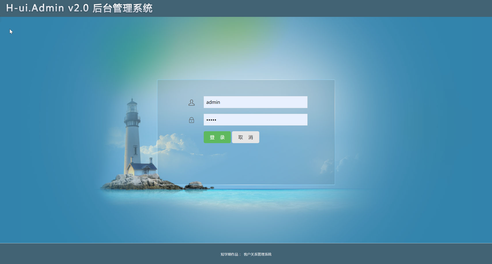
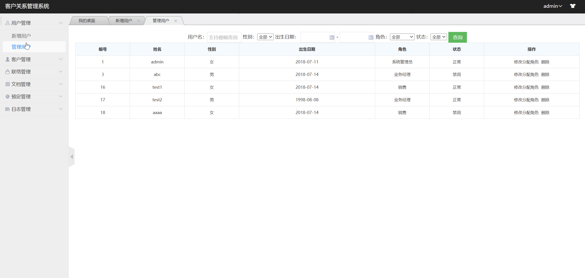
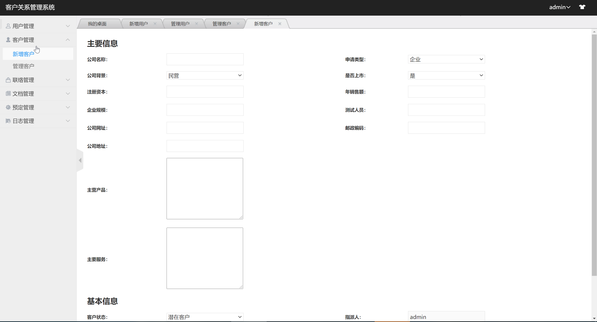
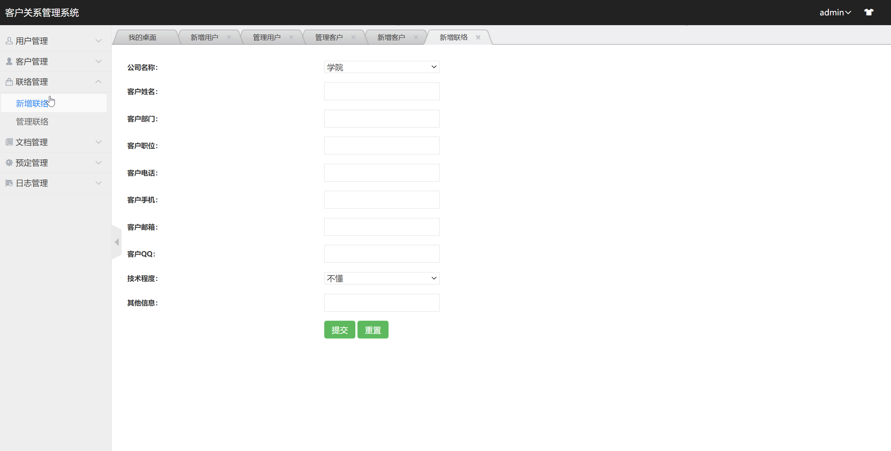
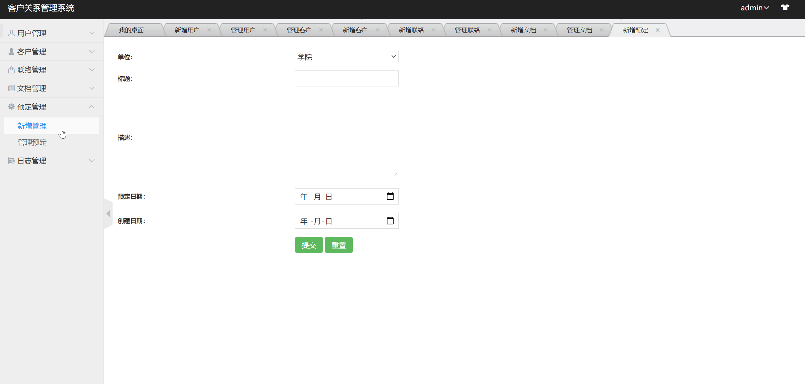
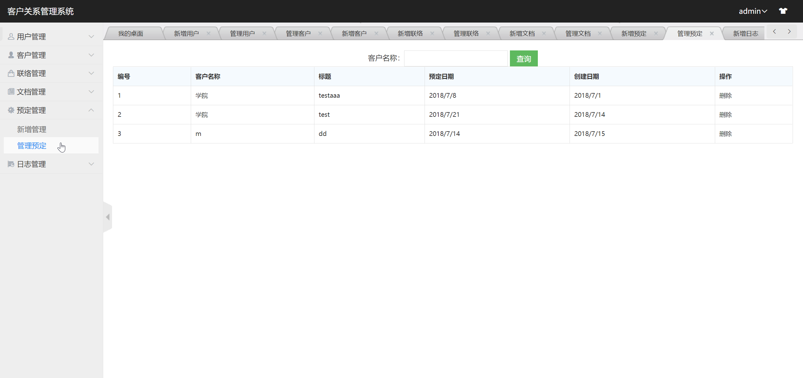
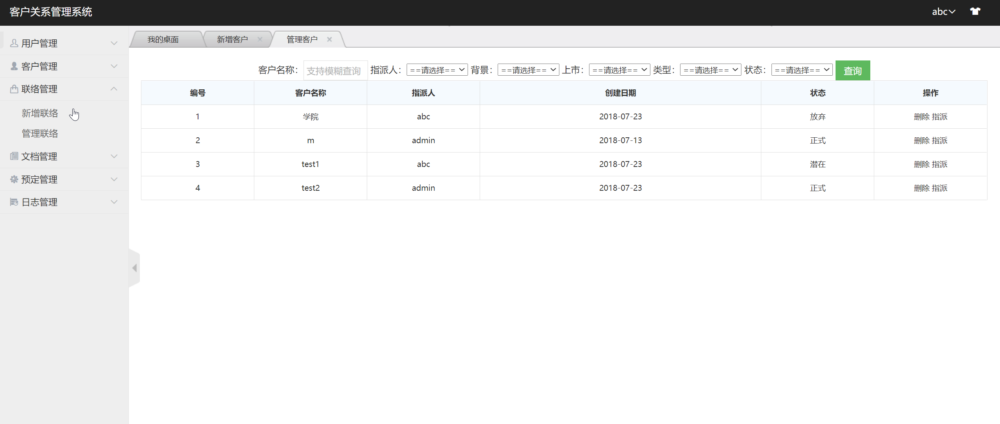

## 基于SpringBoot的实现的客户关系管理系统

###  获取sql数据库文件: 从戎源码网 (https://armycodes.com/) QQ: 386869957 QQ群: 377586148
###  所有系统地址: (https://github.com/YuLin-Coder/AllProjectCatalog) 
###  所有项目以及源代码本人均调试运行无问题 可支持远程安装部署调试、定制修改、代码讲解

## 项目介绍
基于SpringBoot的实现的客户关系管理系统（CRM），主要功能如下

权限管理模块: 包括系统的登录与注册功能
用户管理模块: 基于RBAC的权限模型设计, 实现分配角色的功能功能
客户管理模块: 对客户信息进行新增 修改 删除 查看
联络信息管理模块: 对联络信息进行增删改查
文档管理模块: 对文档进行管理
预订管理模块: 可以新增预订, 查询修改删除预订信息
日志管理模块: 新增管理日志

## 项目技术
- 编程语言：Java
- 数据库：MySQL
- 项目管理工具：Maven
- 前端技术：HTML、CSS、JavaScript、Jquery
- 后端技术：Spring、SpringMVC、MyBatis

## 运行环境
- JDK版本：JDK1.8及以上
- 开发工具：IDEA、Ecplise、Myecplise都可以
- 数据库: MySQL5.7及以上
- Maven：maven3.0及以上

## 运行截图

